### UNIVERSIDAD SAN CARLOS DE GUATEMALA
FACULTAD DE INGENIERÍA  
ESCUELA DE CIENCIAS Y SISTEMAS  
LABORATORIO DE INTELIGENCIA ARTIFICIAL 1
SECCIÓN A

|  Nombre | Carnet  |
| ------------ | ------------ |
| Jose Carlos Moreira Paz | 201701015 |
| Paula Gabriela García Reinoso | 201700823 |

# MANUAL DE USUARIO
## Descripcion 
La practica consiste en la automatizacion de dos procesos para el amacenamiento de la informacion de libros a partir de su codigo isbn, utilizando las herramientas que nos proporciona Uipath.
## Proceso #1
El proceso uno consiste en almacenar los isbn a buscar para enviarlos a una cola en el orchestrator.

- Para iniciar con la ejecucion del proceso 1, primero nos dirigimos a la pagina donde se encuentra el orchestrator de uipath, donde previamente ha sido subido el proceso a automatizar. 
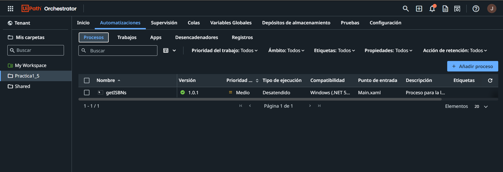  
- En esta pagina seleccionamos el proceso que subimos y hacemos click en el boton para iniciar el trabajo.   
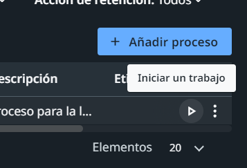  
- Luego seleccionamos la cuenta, maquina y host donde correra el proceso automatizado.
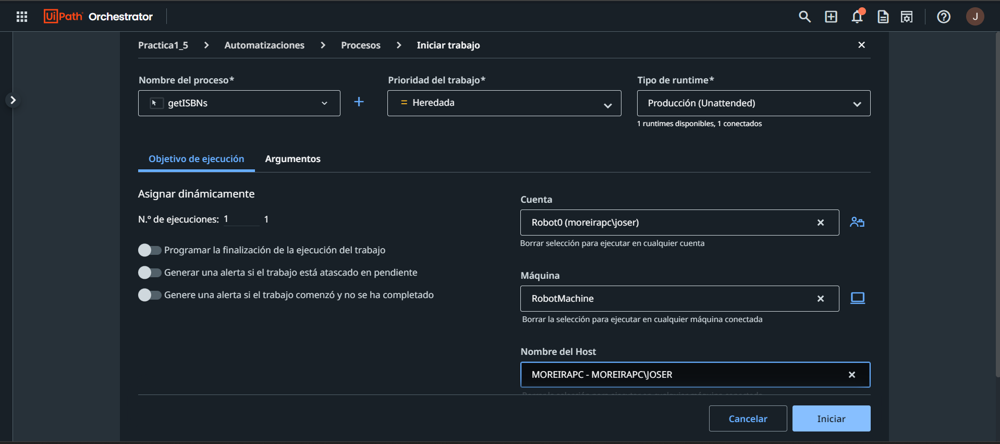  
- Posteriormente nos saldra un mensaje indicando que el trabajo ya se esta ejecutando.
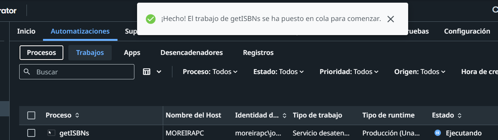  
- Es importante saber que el excel que sera utilizado este en el siguiente formato.
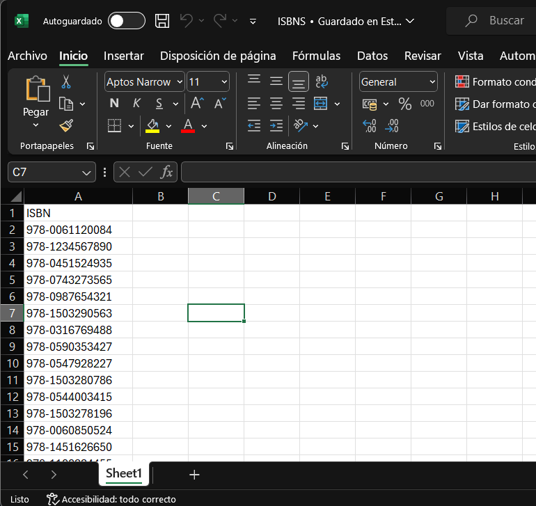
- Para verificar el buen funcionamiento del programa podemos observar el contenido de las colas eso lo hacemos yendo a l apartado de **Colas** y aqui hacemos click derecho a la cola **ISBNs_5** y seleccionamos **ver transacciones** 
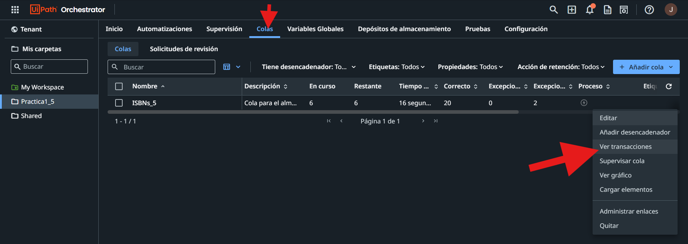  
De esta manera popdremos observar todos los procesos nuevos que han sido ingresados.
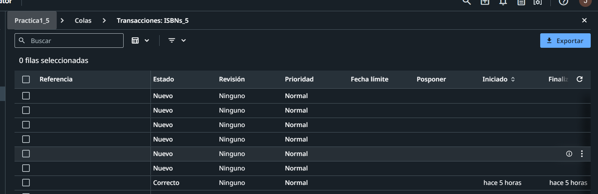  
- Una vez cargados todos los elementos del exel en el area donde ejecutamos el proceso indicara un me saje de **Correcto** comprobando que el proceso ha finalizado sin errores
  

## Proceso #2
- Para la ejecucion del proceso 2 nos dirigimos al proyecto del proceso en uipath studio y hacemos click en Depurar el archivo, de est manera lo ejecutaremos.
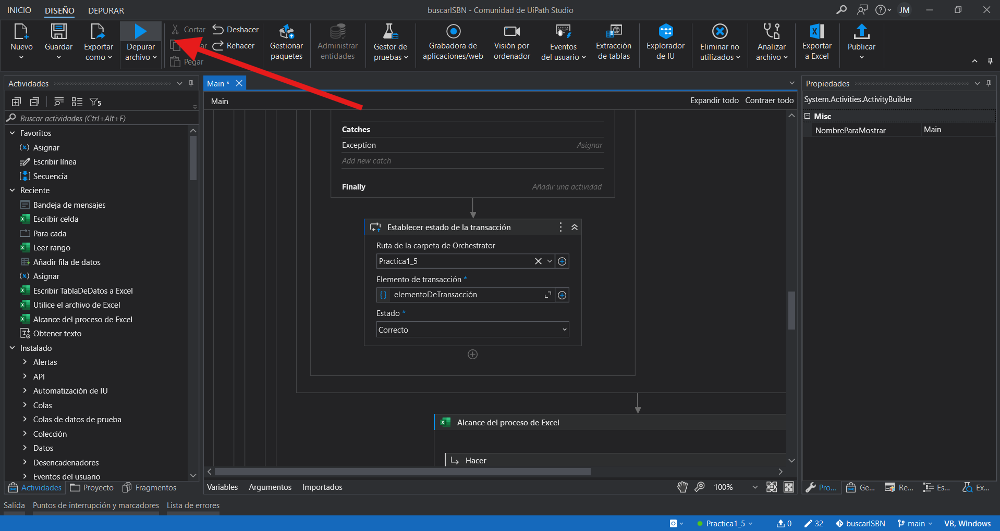  
- El programa automaticamente hara el resto, tomara los valores de la cola, abrira la pagina de **isbndb**
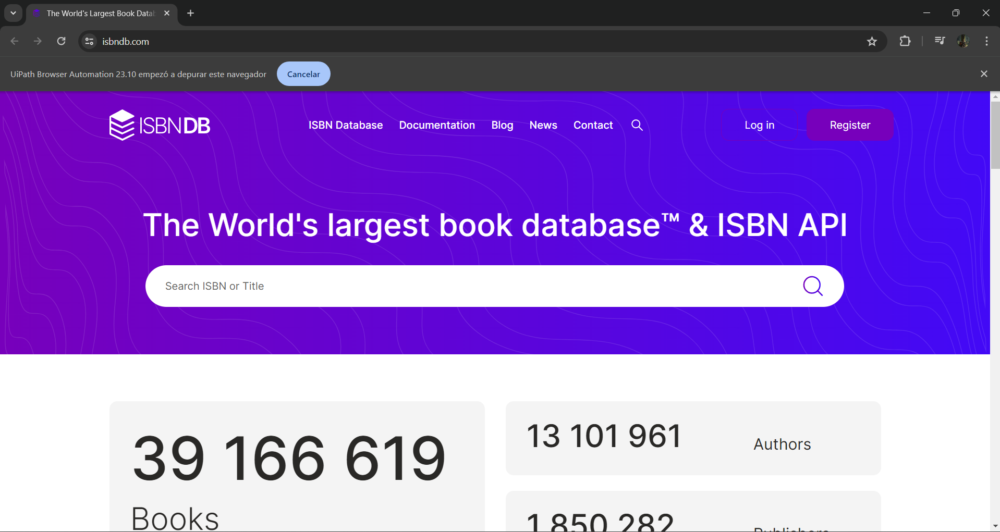  
    Y empezara a escribir la informacion respectiva en un archivo exel
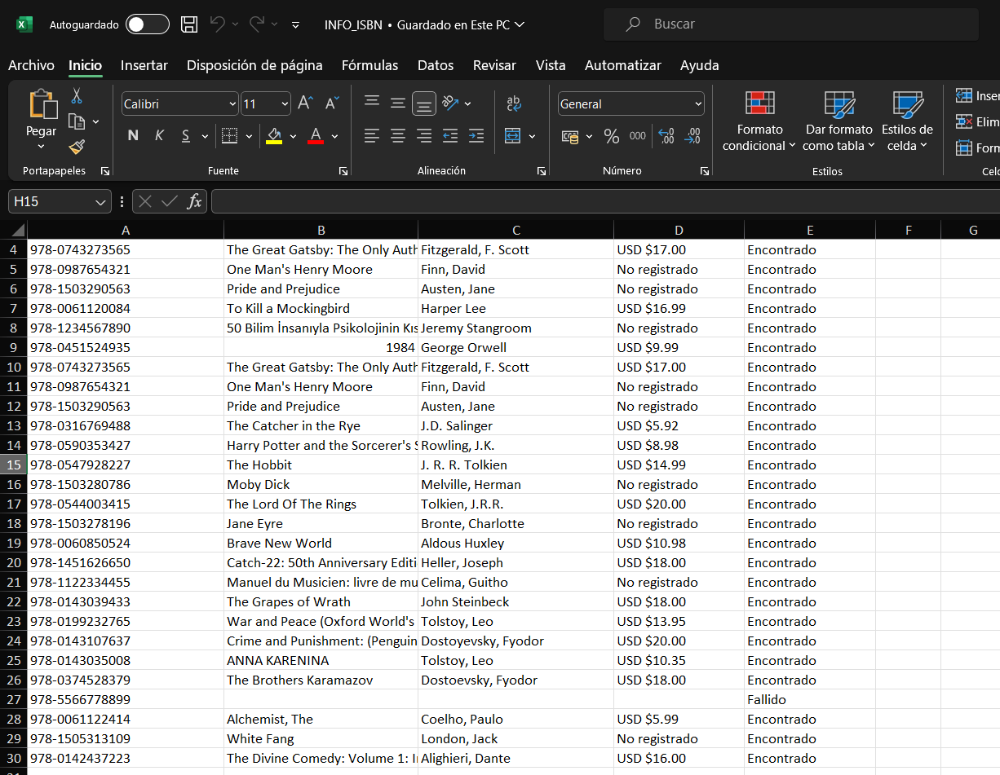 
- Asi mismo, En el Area de colas anteriormente mencionada,se iran cambiando el estado de las transacciones que ya han sido visitadas segun si se encontro la informacion o no. 
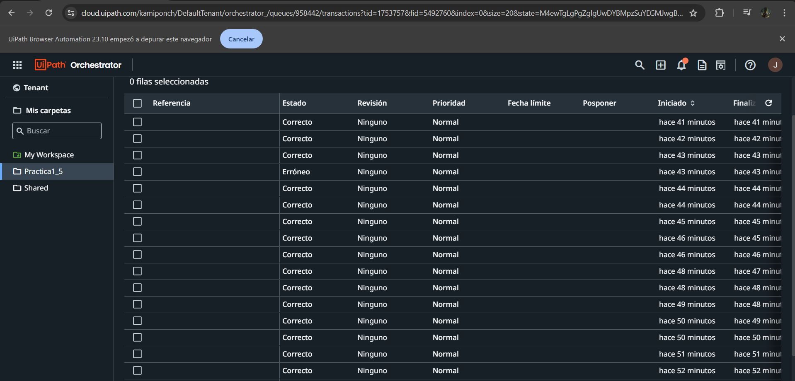  

