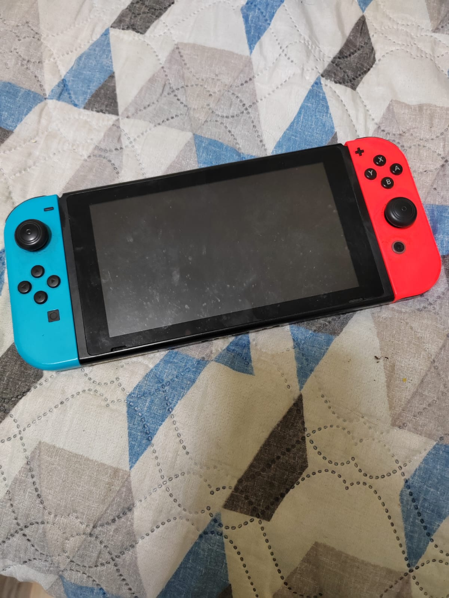
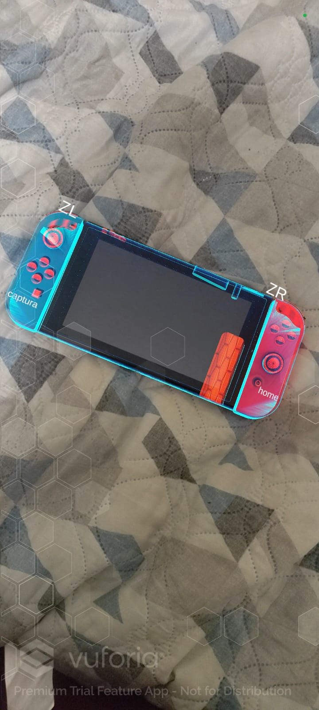

### UNIVERSIDAD SAN CARLOS DE GUATEMALA
FACULTAD DE INGENIERÍA  
ESCUELA DE CIENCIAS Y SISTEMAS  
LABORATORIO DE INTELIGENCIA ARTIFICIAL 1
SECCIÓN A

|  Nombre | Carnet  |
| ------------ | ------------ |
| Jose Carlos Moreira Paz | 201701015 |
| Paula Gabriela García Reinoso | 201700823 |

# MANUAL DE USUARIO
## Descripcion 
La aplicacion consiste una funcionalidad de realidad aumentada, la cual reconoce un nintendo switch y resalta los componetes de botones ZR,ZL, Captura de pantalla y home.

### Instalacion
- Para su instalacion hay que descargar el apk adjuntado en el presente repositorio en un dispositivo android Oreo o mayor.
- Posteriormente hay que abrir el archivo desde el dispositivo movil yutilizarun instalador de paquetes para que la aplicacion pueda ser utilizada.

### Uso

Para su uso lo unico que hay que realizar es apuntar con la camara a la nintendo switch y esta la resaltara e indicara los componentes indicados.

    Cuando la aplicacion no esta activa la imagen de una nintendo switch se veria de la siguiente manera:

  

    Utilizando la aplicacion Asi se veria la nintendo switch:
    
  

### Consideraciones
- Evitar mover muy rapido la camara porque puede interferir con el reconocimietno del objeto

-Evitar mover muy rapido el nintendo switch porque puede interferir con el reconocimietno del objeto

